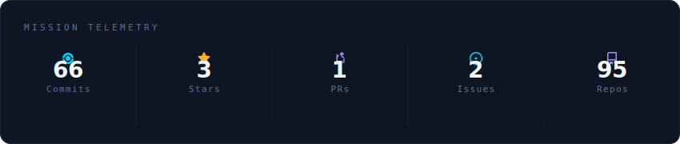
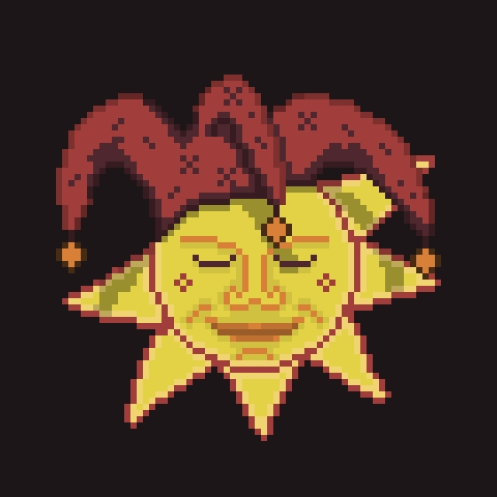
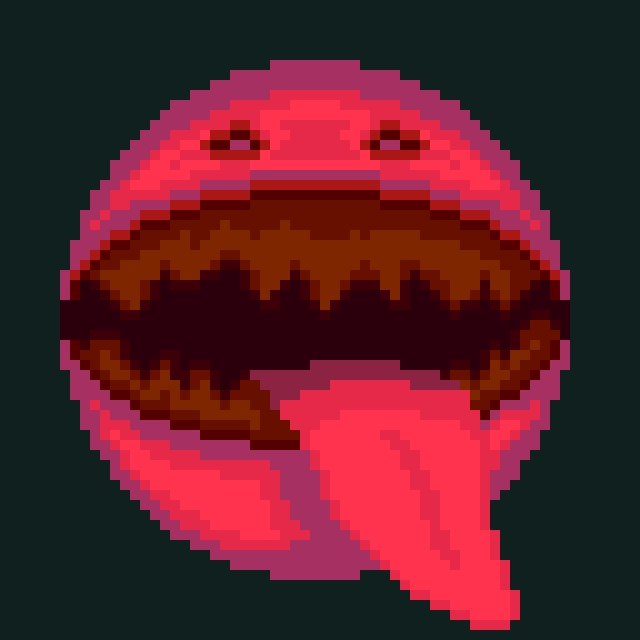
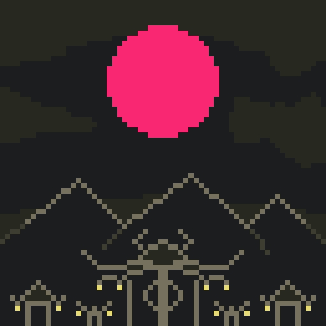
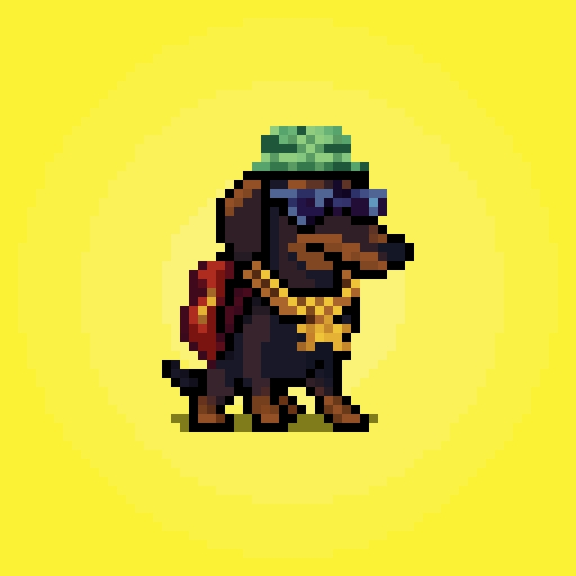
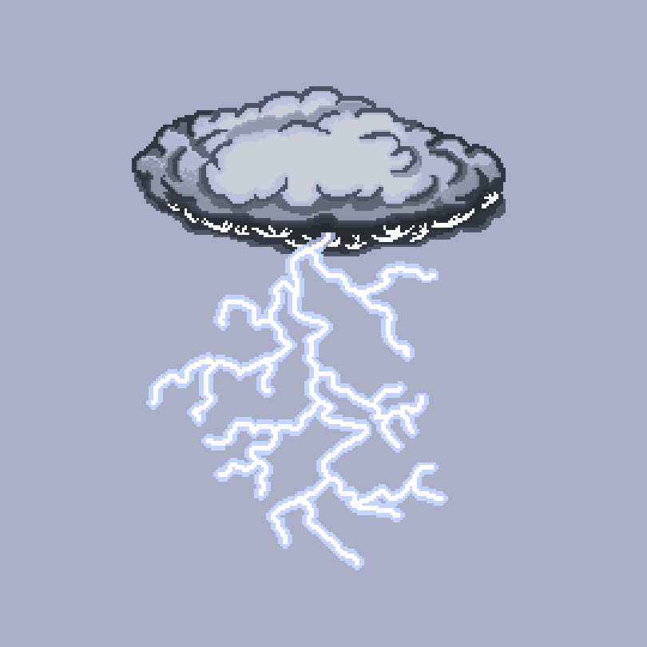
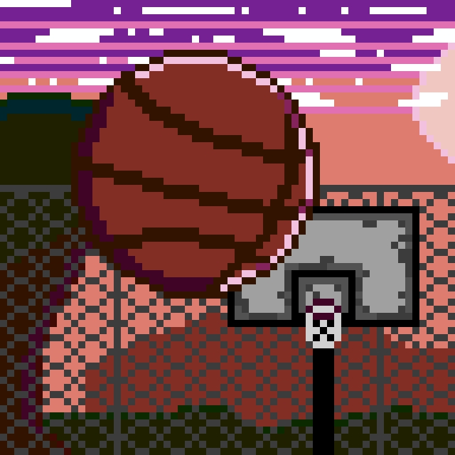

  

 

  

 

  

 

  

 

<strong>More about me</strong>

 

Focused on learning through real-world projects and continuous improvement.
Interested in software development, automation, and game development.

## 🎮 Pixel Art

  
  
  
  
  
  
  

  

 

  
  

